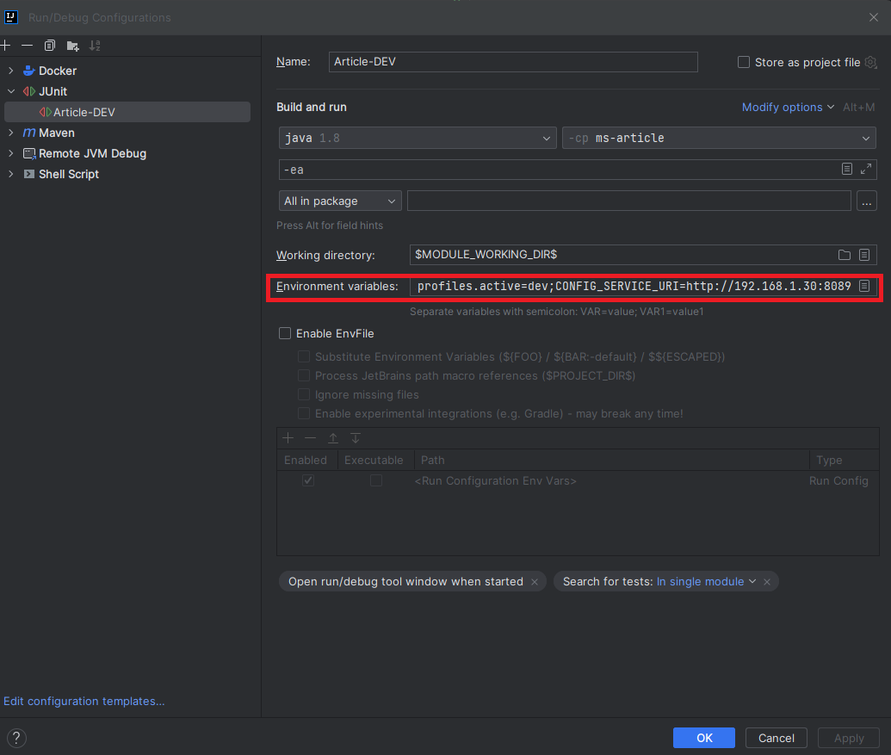

## Table of contents
* [General info](#general-info)
* [Technologies](#technologies)
* [Setup](#setup)
* [Script](#Script)
* [Dev](#Dev)

## General info

The purpose of this micro service is to list all the micro-services of the server to which it is assigned. 
All its micro services must register as soon as they are launched.

this service cannot be used alone, since it works in duo with a service Gateway type

## Technologies
this project is created with :
* Spring boot version : 2.4.5

## Setup 
To run this project, you will need to set up the application-dev.properties environment
file and must be set with Maven goals. For example Maven goals and running spring boot

`$ mvn clean install -Pdev spring.run`

## Script
Le dossier script contient les fichiers suivant :
* init.sh : permet de lancer le docker compose 
* down.sh : permet l'arréter est la suppression du conteneur et l'images 
* get_machine_ip.sh : permet de récupére l'IP 
* reseau.sh : permet de voir le reseau bridge du conteneur 

Pour pouvoir lancer ces fichier, il faut un interpréteur de type `UNIX`. 
Le `Git bash` peux être utilisé, mais pas 100%.

## Dev
Pour créer dans intellij, un module de lancement :  
`clean test -Dspring.profiles.active=dev spring-boot:run -Dspring-boot.run.jvmArguments=-Dspring.profiles.active=dev`

Pour les test unitaire :
`profiles.active=dev;CONFIG_SERVICE_URI=http://192.168.1.30:8089`
